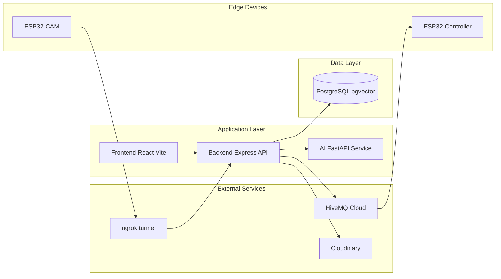
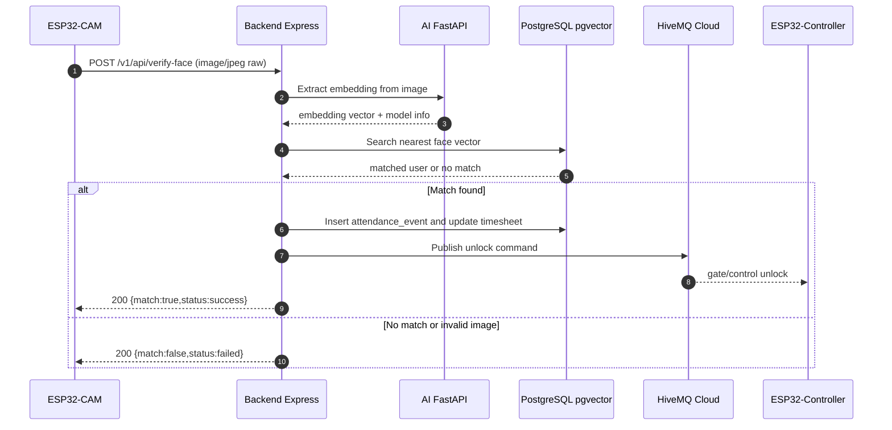
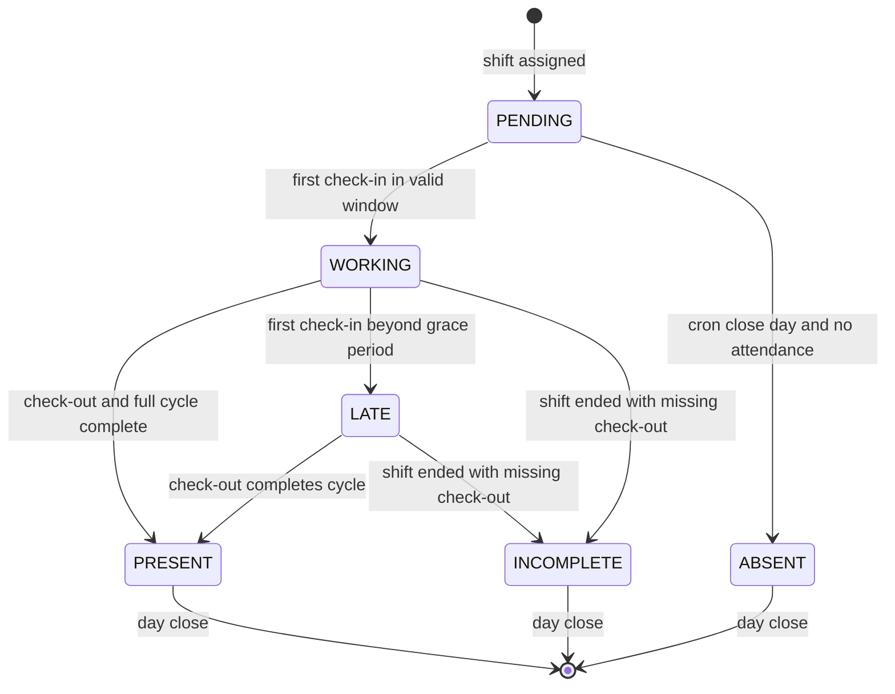

# IoT-Attendance-System

Hệ thống chấm công IoT dùng ESP32-CAM, backend Node.js/Express, AI service Python và PostgreSQL + pgvector.

  
📐 Hiển thị Kiến Trúc Tổng Quan

  
🔄 Hiển thị Luồng Xác Minh Khuôn Mặt

  
📊 Hiển thị Trạng Thái Bảng Công

## Các Sơ Đồ Chi Tiết

### Sơ Đồ Chính (hiển thị ở trên)

- 📐 Kiến Trúc Tổng Quan
- 🔄 Luồng Xác Minh Khuôn Mặt
- 📊 Trạng Thái Bảng Công

### Sơ Đồ Mở Rộng

- 🌐 [Deployment Diagram](docs/diagrams/deployment.md) - Cách các thành phần được triển khai trên server/cloud
- 📈 [Data Flow Diagram](docs/diagrams/dataflow.md) - Luồng dữ liệu qua các lớp xử lý
- 🏗️ [Component Diagram](docs/diagrams/components.md) - Cấu trúc các component và dependencies

### Tài Liệu Bổ Sung

- 📑 [Diagram Index](docs/diagrams/index.md) - Tổng hợp tất cả 7 sơ đồ
- 📘 [Luồng Nghiệp Vụ Chấm Công](docs/attendance_logic.md)
- 🔧 [Mô Tả Kiến Trúc Backend](docs/backend_doc.md)
- 📄 [Báo Cáo Backend & Frontend](docs/fullstack_report.md)
