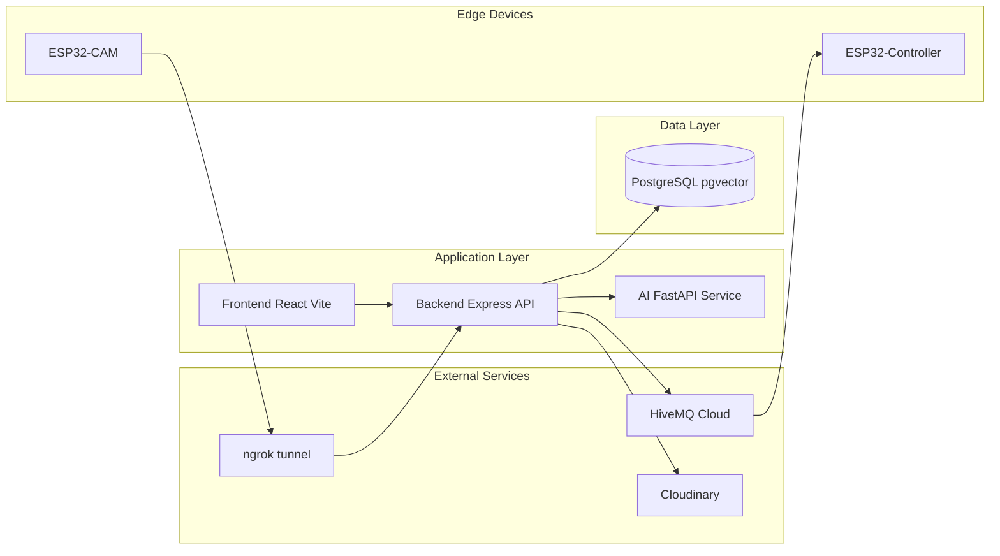

# System Architecture Diagram

```mermaid
flowchart LR
    subgraph E[Edge Devices]
        CAM[ESP32-CAM]
        CTRL[ESP32-Controller]
    end

    subgraph A[Application Layer]
        FE[Frontend React Vite]
        BE[Backend Express API]
        AI[AI FastAPI Service]
    end

    subgraph D[Data Layer]
        PG[(PostgreSQL pgvector)]
    end

    subgraph X[External Services]
        NG[ngrok tunnel]
        MQ[HiveMQ Cloud]
        CD[Cloudinary]
    end

    CAM --> NG --> BE
    FE --> BE
    BE --> AI
    BE --> PG
    BE --> MQ
    MQ --> CTRL
    BE --> CD
```
