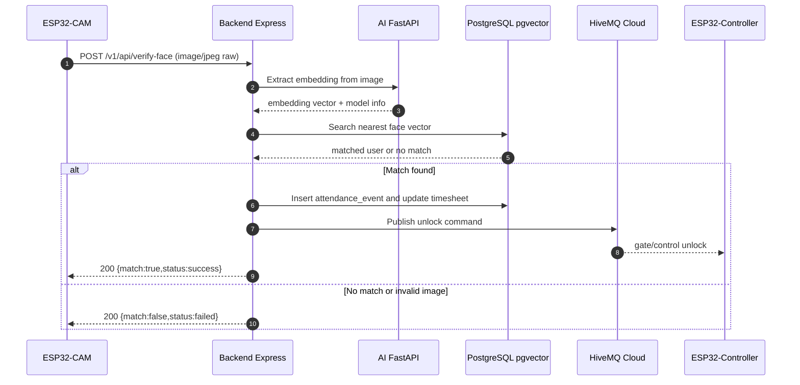

# Attendance Verification Sequence Diagram

```mermaid
sequenceDiagram
    autonumber
    participant CAM as ESP32-CAM
    participant BE as Backend Express
    participant AI as AI FastAPI
    participant DB as PostgreSQL pgvector
    participant MQ as HiveMQ Cloud
    participant CTRL as ESP32-Controller

    CAM->>BE: POST /v1/api/verify-face (image/jpeg raw)
    BE->>AI: Extract embedding from image
    AI-->>BE: embedding vector + model info
    BE->>DB: Search nearest face vector
    DB-->>BE: matched user or no match

    alt Match found
        BE->>DB: Insert attendance_event and update timesheet
        BE->>MQ: Publish unlock command
        MQ-->>CTRL: gate/control unlock
        BE-->>CAM: 200 {match:true,status:success}
    else No match or invalid image
        BE-->>CAM: 200 {match:false,status:failed}
    end
```
