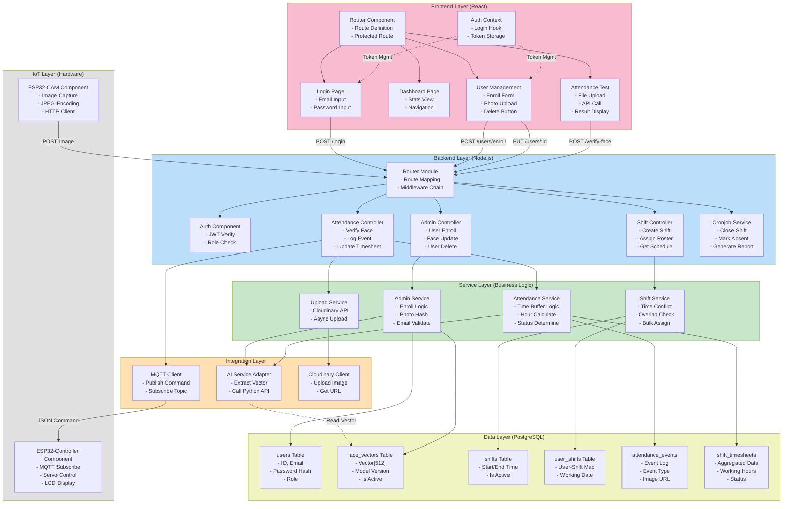

# Component Diagram

## Mô Tả Các Thành Phần

### IoT Layer

- **ESP32-CAM**: Bắt ảnh, encode JPEG, gửi qua HTTP POST
- **ESP32-Controller**: Nhận lệnh MQTT, điều khiển servo mở cửa, hiển thị LCD

### Backend Layer

- **Router**: Định tuyến request và gắn middleware
- **Auth**: Xác minh JWT, kiểm tra role
- **Admin/Shift/Attend Controllers**: Xử lý request của từng domain
- **Cronjob Service**: Chạy tự động để chốt sổ công

### Service Layer

- **Admin Service**: Xử lý logic đăng ký người dùng, hash ảnh
- **Shift Service**: Kiểm tra xung đột thời gian ca làm
- **Attendance Service**: Tính giờ, xác định trạng thái công
- **Upload Service**: Gửi ảnh lên Cloudinary bất đồng bộ

### Integration Layer

- **AI Adapter**: Gọi Python service để extract vector
- **MQTT Client**: Publish lệnh unlock qua HiveMQ
- **Cloudinary Client**: Upload và lưu ảnh lên cloud

### Data Layer

- 6 bảng PostgreSQL chính quản lý dữ liệu system

### Frontend Layer

- **Router**: Quản lý các tuyến đường và bảo vệ route
- **Auth Context**: Lưu token và thông tin user
- **Pages**: Login, Dashboard, User Management, Attendance Test
