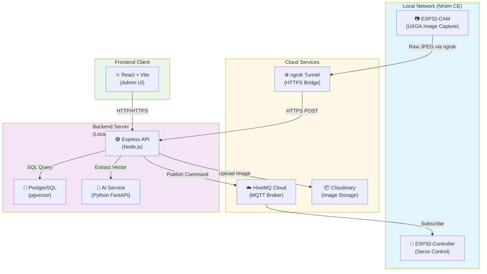

# Deployment Diagram

## Mô Tả Triển Khai

- **Local Network (CE)**: Thiết bị IoT (camera, controller) chạy trên mạng nội bộ
- **ngrok Tunnel**: Cải tiến khả năng truy cập từ bên ngoài để ESP32-CAM có thể gửi ảnh đến backend
- **HiveMQ Cloud**: MQTT broker công cộng để gửi lệnh điều khiển từ backend đến controller
- **Cloudinary**: Lưu trữ ảnh chấm công trên cloud
- **Backend Server**: Có thể chạy trên máy local hoặc cloud, lắng nghe request từ frontend và IoT devices
- **PostgreSQL**: Cơ sở dữ liệu chứa vector khuôn mặt (pgvector) để so khớp nhanh
- **AI Service**: Microservice Python chạy riêng biệt để trích xuất embedding từ ảnh
- **Frontend**: Web app React dùng để quản trị người dùng, xem bảng công, test API
