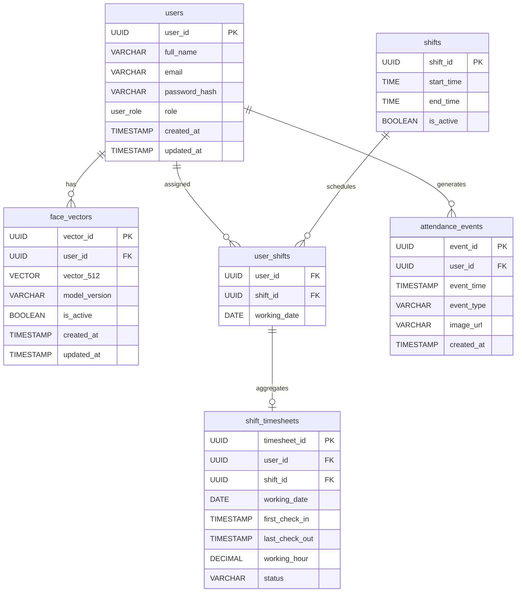

# Database ERD Diagram

```mermaid
erDiagram
    users {
        UUID user_id PK
        VARCHAR full_name
        VARCHAR email
        VARCHAR password_hash
        user_role role
        TIMESTAMP created_at
        TIMESTAMP updated_at
    }

    face_vectors {
        UUID vector_id PK
        UUID user_id FK
        VECTOR vector_512
        VARCHAR model_version
        BOOLEAN is_active
        TIMESTAMP created_at
        TIMESTAMP updated_at
    }

    shifts {
        UUID shift_id PK
        TIME start_time
        TIME end_time
        BOOLEAN is_active
    }

    user_shifts {
        UUID user_id FK
        UUID shift_id FK
        DATE working_date
    }

    attendance_events {
        UUID event_id PK
        UUID user_id FK
        TIMESTAMP event_time
        VARCHAR event_type
        VARCHAR image_url
        TIMESTAMP created_at
    }

    shift_timesheets {
        UUID timesheet_id PK
        UUID user_id FK
        UUID shift_id FK
        DATE working_date
        TIMESTAMP first_check_in
        TIMESTAMP last_check_out
        DECIMAL working_hour
        VARCHAR status
    }

    users ||--o{ face_vectors : has
    users ||--o{ user_shifts : assigned
    shifts ||--o{ user_shifts : schedules
    users ||--o{ attendance_events : generates
    user_shifts ||--o| shift_timesheets : aggregates
```
