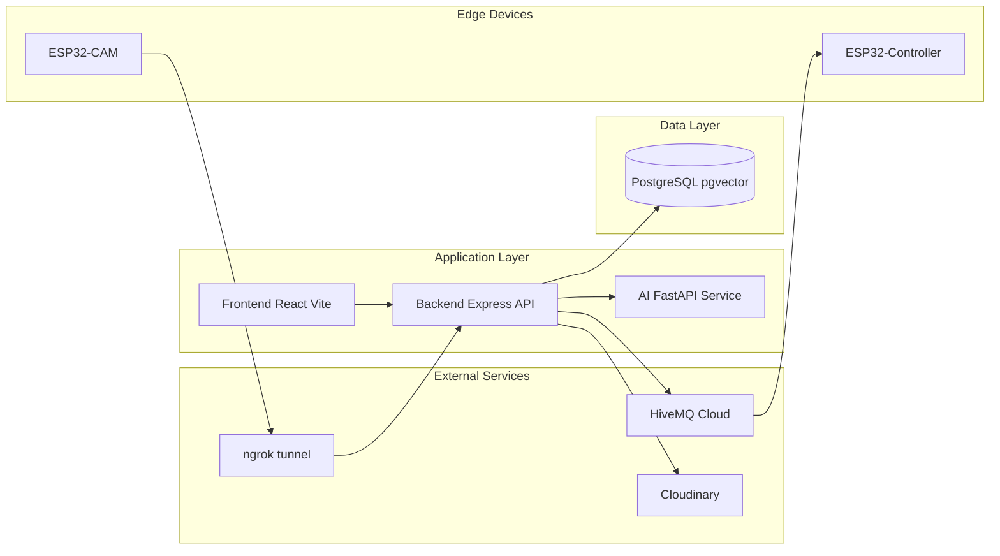
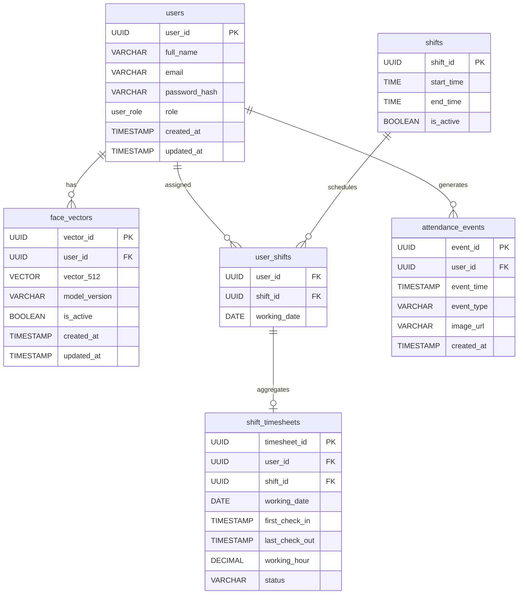
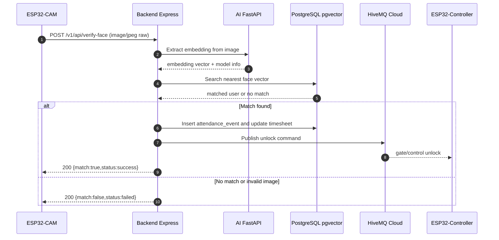
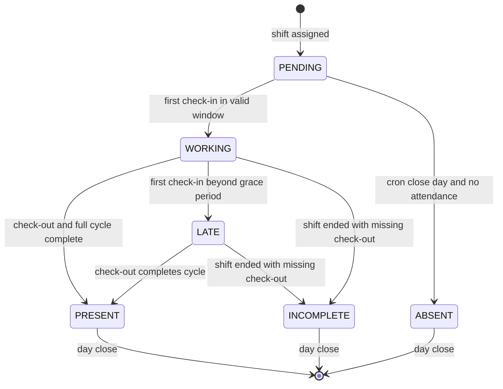

# IoT Attendance - Diagram Index

Trang này tổng hợp toàn bộ 4 sơ đồ chính của dự án để tiện theo dõi và trình bày.

## Muc luc

1. [System Architecture](./architecture.md)
2. [Database ERD](./erd.md)
3. [Attendance Verification Sequence](./attendance-sequence.md)
4. [Timesheet State Machine](./timesheet-state.md)

---

## 1) System Architecture

---

## 2) Database ERD

---

## 3) Attendance Verification Sequence

---

## 4) Timesheet State Machine

