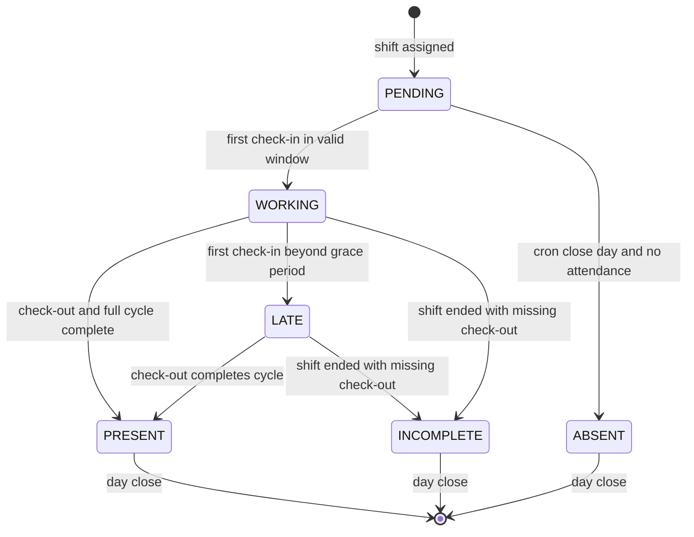

# Timesheet Status State Diagram

```mermaid
stateDiagram-v2
    [*] --> PENDING: shift assigned

    PENDING --> WORKING: first check-in in valid window
    WORKING --> PRESENT: check-out and full cycle complete
    WORKING --> LATE: first check-in beyond grace period
    LATE --> PRESENT: check-out completes cycle

    WORKING --> INCOMPLETE: shift ended with missing check-out
    LATE --> INCOMPLETE: shift ended with missing check-out

    PENDING --> ABSENT: cron close day and no attendance
    INCOMPLETE --> [*]: day close
    PRESENT --> [*]: day close
    ABSENT --> [*]: day close
```
